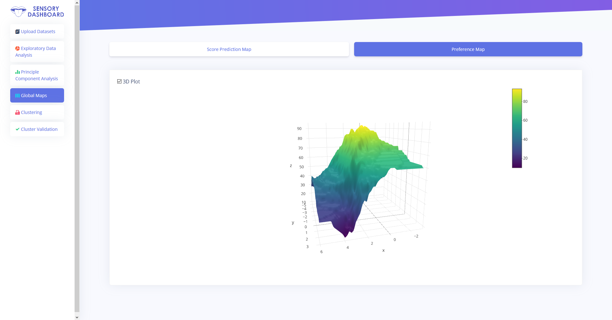
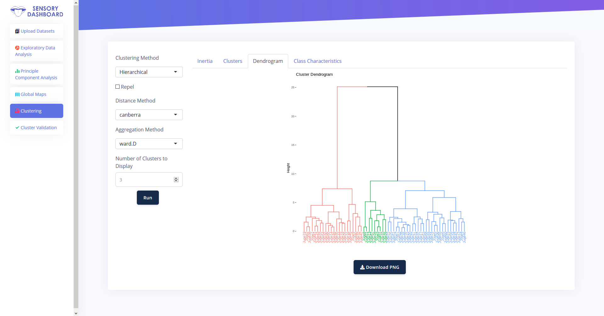
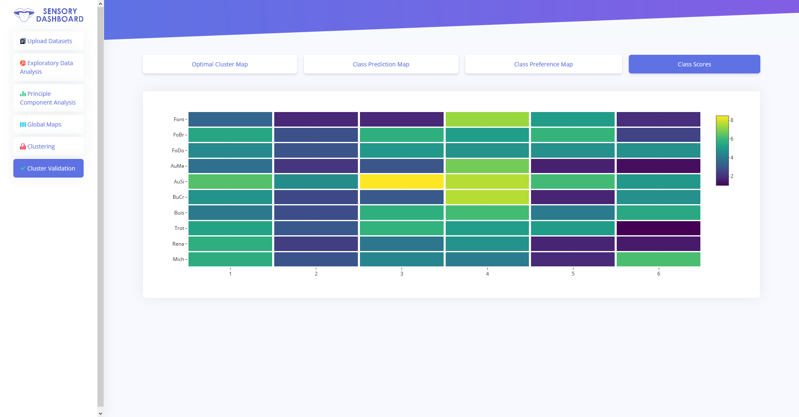
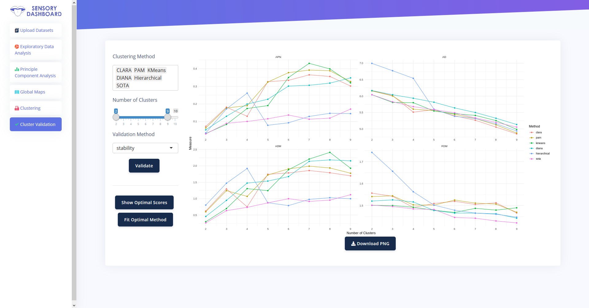

# SensoDash

## Installation

```r
devtools::install_github("khllkcm/SensoDash")
```

## Demo

See a demonstration on an open source shiny server [here](https://khalil.kacem.xyz/shiny/SensoryDashboard/).

```r
SensoDashUI()
```

### 3D interactive preference map

<br>


### Dendrogram

<br>



### Interactive class score map

<br>



### Validity/Stability scores

<br>

